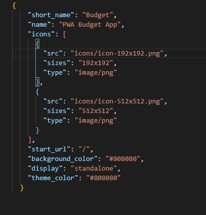
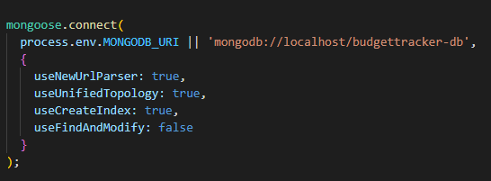
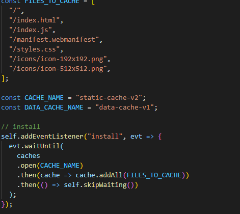

# BudgetPWA

## Purpose of this app
This 'Progressive Web Application' allows a User to keep track of their money by keeping track of their income and expenses.

This happens by having the User input a name for the reason of the expense and the amount. 

Then it displays a graph to help the User visualize best and worst days of use for their money.

The best attribute of this appplication is that it can still run while being offline!

## Tech Used
* NODE JS
* JAVASCRIPT
* MONGODB
* EXPRESS
* HEROKU AND MONGO ATLAS FOR DEPLOYMENT

## New skills learned thuogh this app
* Implementation and use of service workers
* Creation and use of a webmanifest

## Code Images

## Credits
Jesus Milan

GitHub: https://github.com/Milan1422
Deployment: https://young-dawn-04333.herokuapp.com/